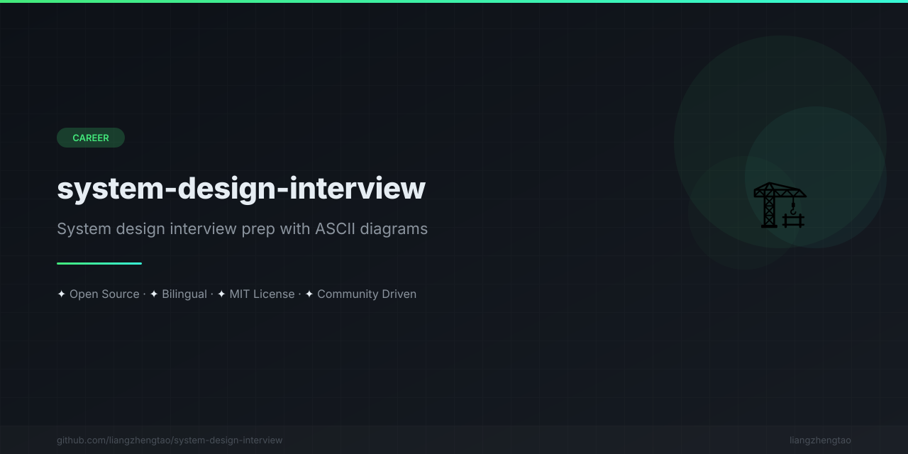

[English](README.md) | [中文](README.zh.md) | [日本語](README.ja.md) | [Français](README.fr.md) | [Español](README.es.md) | [العربية](README.ar.md) | [한국어](README.ko.md) | [Português](README.pt.md) | [Русский](README.ru.md) | [Deutsch](README.de.md)

<div align="center">



</div>


# Руководство по системному проектированию

**Блестяще пройдите интервью по системному проектированию. 10 концепций + 5 полных проектов систем с ASCII-диаграммами.**

---

<p align="center">
  <a href="#концепции">Концепции</a> •
  <a href="#проекты-систем">Проекты систем</a> •
  <a href="#как-использовать">Как использовать</a> •
  <a href="#участие">Участие</a>
</p>

---

## Почему это руководство?

Интервью по системному проектированию — самая сложная часть технических собеседований в ведущих компаниях. Это руководство предоставляет:

- **Структурированный подход** — Пошаговая методика для любого дизайн-вопроса
- **ASCII-диаграммы** — Визуальная архитектура, которую можно нарисовать на доске
- **Анализ компромиссов** — Не один ответ, а несколько подходов с плюсами/минусами
- **Оценка ёмкости** — Реальные цифры для конкретизации вашего проекта
- **Двуязычный контент** — Каждый файл имеет полную китайскую версию

---

## Содержание

- [Концепции](#концепции)
- [Проекты систем](#проекты-систем)
- [Как использовать](#как-использовать)
- [Участие](#участие)
- [Лицензия](#лицензия)

---

## Концепции

Базовые знания, необходимые перед решением задач системного проектирования.

| # | Концепция | Ключевые темы |
|---|----------|---------------|
| 1 | [Основы](concepts/fundamentals.md) | Масштабируемость, теорема CAP, модели консистентности, задержка vs пропускная способность |
| 2 | [Балансировка нагрузки](concepts/load-balancing.md) | L4/L7, round-robin, консистентное хеширование, проверки здоровья |
| 3 | [Кэширование](concepts/caching.md) | Redis, CDN, кэш браузера, стратегии кэширования, инвалидация |
| 4 | [Проектирование БД](concepts/database-design.md) | SQL vs NoSQL, индексация, шардинг, репликация, ACID |
| 5 | [Очереди сообщений](concepts/message-queues.md) | Kafka, RabbitMQ, событийно-ориентированная архитектура, exactly-once |

### Карта концепций

```
                        ┌─────────────────────────┐
                        │  System Design           │
                        │  Fundamentals            │
                        └────────────┬────────────┘
                                     │
                 ┌───────────────────┼───────────────────┐
                 │                   │                   │
          ┌──────▼──────┐    ┌──────▼──────┐    ┌──────▼──────┐
          │ Load Balancing│    │   Caching   │    │  Database   │
          └──────┬──────┘    └──────┬──────┘    └──────┬──────┘
                 │                   │                   │
                 └───────────────────┼───────────────────┘
                                     │
                             ┌───────▼───────┐
                             │ Message Queues │
                             └───────┬───────┘
                                     │
                        ┌────────────▼────────────┐
                        │    System Designs        │
                        └─────────────────────────┘
```

---

## Проекты систем

Полные end-to-end решения для популярных задач системного проектирования на интервью.

| # | Проект | Сложность | Ключевые концепции |
|---|--------|-----------|-------------------|
| 1 | [Сокращатель URL](designs/url-shortener.md) | ⭐⭐ | Кодирование Base62, хеширование, редирект, аналитика |
| 2 | [Система чата](designs/chat-system.md) | ⭐⭐⭐ | WebSocket, очередь сообщений, присутствие, доставка |
| 3 | [Лента новостей](designs/news-feed.md) | ⭐⭐⭐ | Fan-out, ранжирование, таймлайн, социальный граф |
| 4 | [Поисковая система](designs/search-engine.md) | ⭐⭐⭐⭐ | Инвертированный индекс, краулинг, ранжирование, NLP |
| 5 | [Распределённый кэш](designs/distributed-cache.md) | ⭐⭐⭐⭐ | Консистентное хеширование, репликация, вытеснение |

---

## Как использовать

### Для подготовки к интервью

```
Step 1: Read concepts/fundamentals.md to build your foundation
Step 2: Study each concept file (2-3 hours total)
Step 3: Practice system designs (1-2 hours each)
Step 4: Time yourself — aim for 45 minutes per design
Step 5: Review trade-offs and practice explaining decisions
```

### Для дня интервью

```
┌─────────────────────────────────────────────────┐
│           45-Minute Interview Structure          │
├─────────────────────────────────────────────────┤
│                                                 │
│  0-5 min    Requirements clarification           │
│                                                 │
│  5-10 min   High-level design                   │
│                                                 │
│  10-25 min  Deep dive into core components       │
│                                                 │
│  25-35 min  Scaling & trade-offs                │
│                                                 │
│  35-45 min  Monitoring & failure scenarios       │
│                                                 │
└─────────────────────────────────────────────────┘
```

### Фреймворк RESHADED

Каждый проект в этом руководстве следует фреймворку **RESHADED**:

```
R - Requirements       Requirements analysis
E - Estimation          Capacity estimation
S - Storage design      Storage design
H - High-level design   High-level design
A - API design          API design
D - Detailed design     Detailed design
E - Evaluation          Trade-off evaluation
D - Distinctive component  Differentiating component
```

---

## Дорожная карта

- [x] 5 файлов с базовыми концепциями
- [x] 5 полных проектов систем
- [x] Двуязычный контент (английский + китайский)
- [ ] Ещё 5 проектов (Rate Limiter, Система уведомлений, Видеостриминг, Веб-краулер, Key-Value Store)
- [ ] Карточки Anki для интервального повторения
- [ ] Интерактивные диаграммы

---

## Участие

Приветствуется вклад! Подробности в [CONTRIBUTING.md](CONTRIBUTING.md).

---

## История звёзд

Если это руководство оказалось полезным, поставьте звезду!

---

## Лицензия

Проект распространяется под лицензией MIT — подробности в файле [LICENSE](LICENSE).

---

<p align="center">
  Сделано с ❤️ от <a href="https://github.com/liangzhengtao">liangzhengtao</a>
</p>
